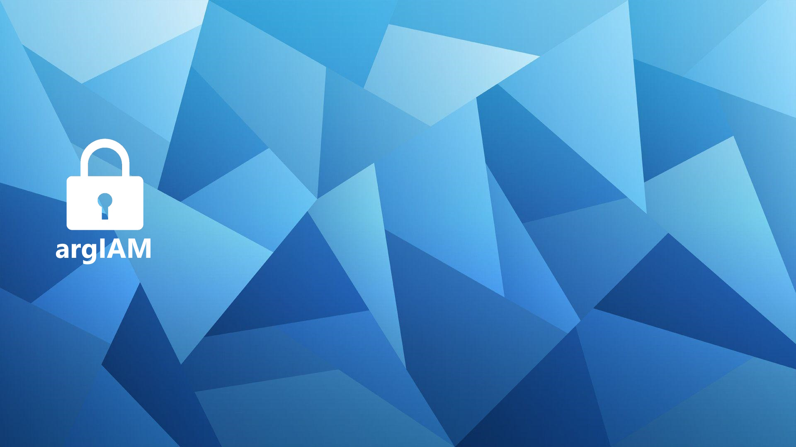

# argIAM

2-person CTF: 1 insider, 1 hacker.

## Installation and hosting

Installation must not run behind a reverse proxy.

Using NodeJS v18.19.0

1. `npm i --force`
2. `npm run build`
3. `node build/`

Service will be running on port 3000. This can easily be changed by setting the `PORT` environment variable to anything else.

## Writeups

[Check all writeups here](writeups/)

[Official Writeup (Not recommended)](writeups/OFFICIAL.md)

[Yor Forgor](writeups/yor_writeup.txt)

[ayy lmao](writeups/alien_writeup.md)

[Magix + Thorn](writeups/magix_writeup.md)